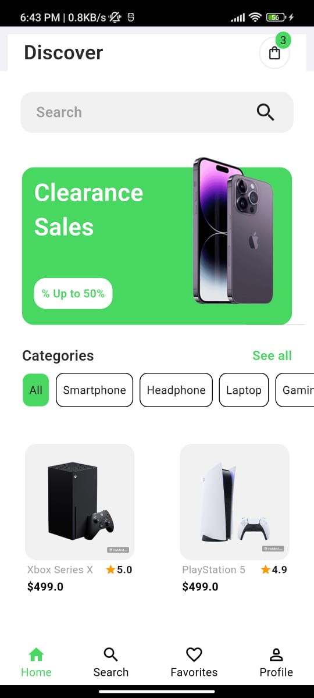
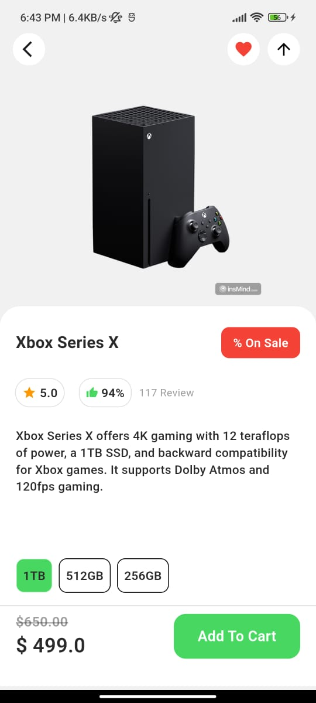
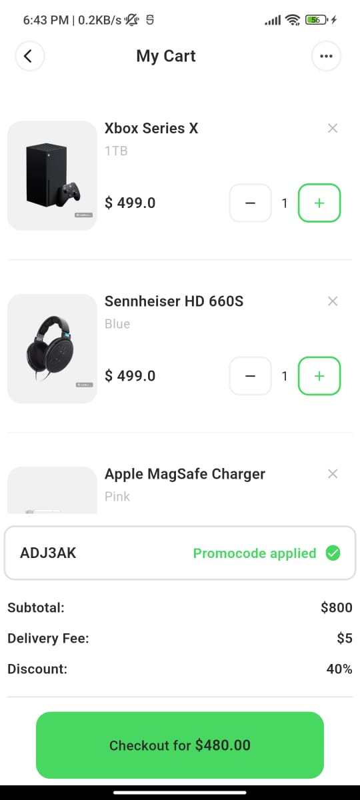

# E-commerce Mobile App UI

A responsive **E-commerce Mobile App UI** built with **Flutter**, designed to provide a seamless shopping experience on mobile devices. This UI includes a clean and modern home page, product details screen, and a cart page.

## Features

- **Responsive Design**: Fully optimized for different screen sizes.
- **Home Page**:
  - Search Bar to find products quickly.
  - Slideshow for discounts and featured products.
  - Categories section to browse products by type.
  - GridView to display all products in an organized manner.
  - Bottom Navigation Bar for easy navigation across the app.
- **Product Details Screen**: Detailed information about the selected product, including images, description, price, and variants.
- **Cart Page**: Manage items added to the cart, update quantities, or remove items.

## Screenshots

  
  
  

## Technologies Used

- **Flutter**: For building the UI.
- **Dart**: Programming language.
